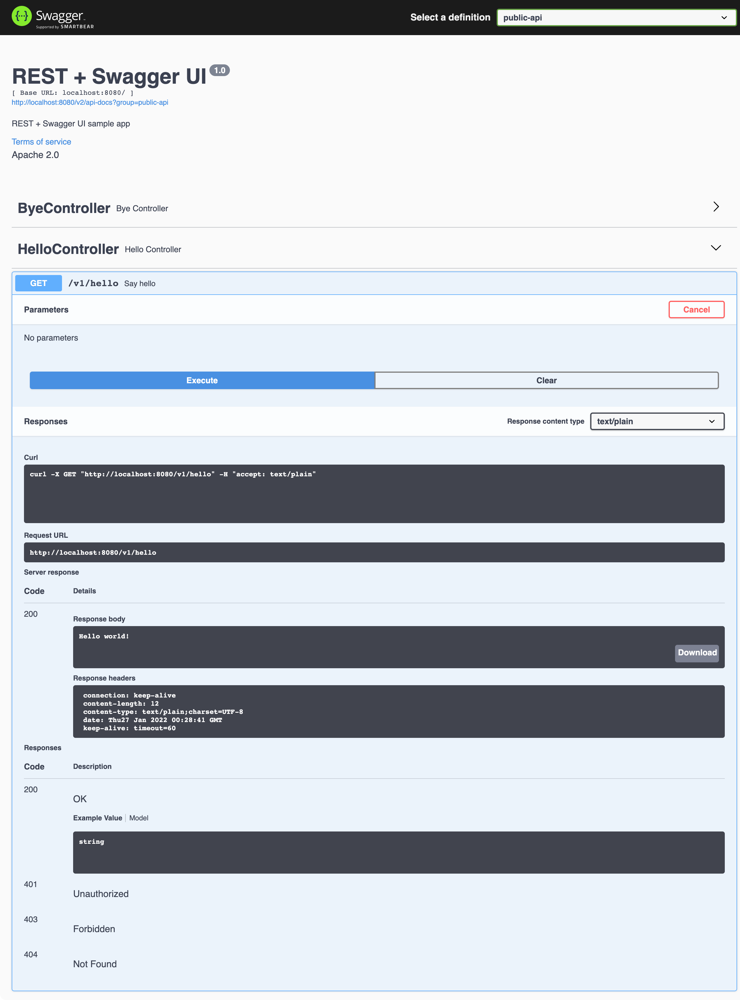

# Image Processing Service

## Table of Contents

- [Overview](#overview)
- [Getting Started](#getting-started)
    - [Compiling the Application](#compiling-the-application)
    - [Running the Application Locally](#running-the-application-locally)
    - [HTTP Endpoints](#http-endpoints)
- [Dockerization](#dockerization)
    - [Creating a Docker Image with Buildpacks](#creating-a-docker-image-with-buildpacks)
    - [Creating a Docker Image with Dockerfile](#creating-a-docker-image-with-dockerfile)
    - [Scanning for Vulnerabilities](#scanning-for-vulnerabilities)
    - [Running the Docker Image](#running-the-docker-image)
- [Deployment](#deployment)
    - [Deploying to Kubernetes](#deploying-to-kubernetes)
    - [Monitoring the Kubernetes Deployment](#monitoring-the-kubernetes-deployment)
    - [Undeploying from Kubernetes](#undeploying-from-kubernetes)
- [Service Implementation Details](#service-implementation-details)
- [Error Handling and Exception Advice](#error-handling-and-exception-advice)
- [Contributing](#contributing)
- [License](#license)

## Overview

The Image Processing Service is a sophisticated, containerized microservice crafted for image processing. It primarily
targets the removal of Exif headers from images, catering to formats like JPEG, PNG, and PDF. This not only ensures user
privacy but also significantly reduces image metadata overhead.

## Getting Started

### Compiling the Application

To compile the project:

```bash
mvn clean package -Djava.version=19
```

### Running the Application Locally

Start the application using:

```bash
mvn clean spring-boot:run -Djava.version=19
```

Access the app at [http://localhost:8080](http://localhost:8080).

### HTTP Endpoints

Test the application's readiness, liveness, and image processing functionalities:

```bash
curl -vv http://localhost:8080/actuator/health/readiness
curl -vv http://localhost:8080/actuator/health/liveness
```

To strip Exif headers from JPEG images:

```bash
curl -v -X POST --fail -F "file=@2O6A1463.jpg" -F "filename=2O6A1463.jpg" --output modified_2O6A1463.jpg --location http://localhost:8080/v1/image/process
curl -v -X POST --fail -F "file=@2O6A1463.jpg" -F "filename=2O6A1463.jpg" --output modified_2O6A1463.jpg --location http://image-processing-service.example.com/image/process


curl -X POST --fail \
  -H "Content-Type: multipart/form-data" \
  -F "file=@2O6A1463.jpg" \
  -F "filename=2O6A1463.jpg" \
  -o "modified_2O6A1463.jpg" \
  -F "userId=007553863DC30029" \
  -F "secureKey=8b31761b2154884c" \
  -F "alias=117" \
  -F "userData[file-description]=March invoice" \
  -F "userData[userKey1]=User value 1" \
  --location http://localhost:8080/v1/image/process


curl -X POST --fail \
  -H "Content-Type: multipart/form-data" \
  -F "file=@2O6A1463.jpg" \
  -F "filename=2O6A1463.jpg" \
  -o "modified_2O6A1463.jpg" \
  -F "userId=007553863DC30029" \
  -F "secureKey=8b31761b2154884c" \
  -F "alias=117" \
  -F "userData[file-description]=March invoice" \
  -F "userData[userKey1]=User value 1" \
  --location http://localhost:8080/v1/serviceNameA/chatId1/file

```

To strip Exif headers from JPEG images:

```bash
curl -v --fail -X POST -F "file=@png1.png" -F "filename=png1.png" --output modified_png1.png --location http://localhost:8080/v1/image/process
```

To process PDF files:

```bash
curl -X POST -H "Content-Type: application/pdf" --data-binary "@input.pdf" http://localhost:8080/process > output.pdf
```

For additional application insights, configurations, and metrics:

```bash
curl http://localhost:8080/actuator | jq .
```

Dive deep into the API using the Swagger UI: [http://localhost:8080/swagger-ui/](http://localhost:8080/swagger-ui/)



## Dockerization

### Creating a Docker Image with Buildpacks

Rely on [Cloud Native Buildpacks](https://buildpacks.io) to construct & push your Docker image:

```bash 
pack build --builder paketobuildpacks/builder:base --publish ln032pnxrepo01.swc/image-processor/image-processor:latest .
```

### Creating a Docker Image with Dockerfile

For Docker enthusiasts:

```bash
docker build -t ln032pnxrepo01.swc/image-processor/image-processor:latest .
```

Push the image to your Docker registry:

```bash
docker push ln032pnxrepo01.swc/image-processor/image-processor:latest
```

### Scanning for Vulnerabilities

Ensure the security of your Docker images:

```bash
trivy image ln032pnxrepo01.swc/image-processor/image-processor:latest
```

### Running the Docker Image

Launch the Dockerized app with:

```bash
docker run --rm -p 8080:8080 ln032pnxrepo01.swc/image-processor/image-processor:latest 
```

## Deployment

### Deploying to Kubernetes

Send the application to your Kubernetes cluster:

```bash

```

### Monitoring the Kubernetes Deployment

Keep track of the allocated IP for the app:

```bash
kubectl -n dev get svc
```

http://image-processing-service.example.com/swagger-ui/


## Service Implementation Details

Refer to solution design on Confluence
